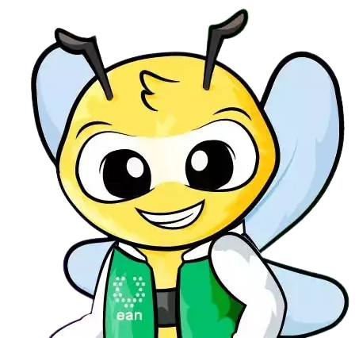
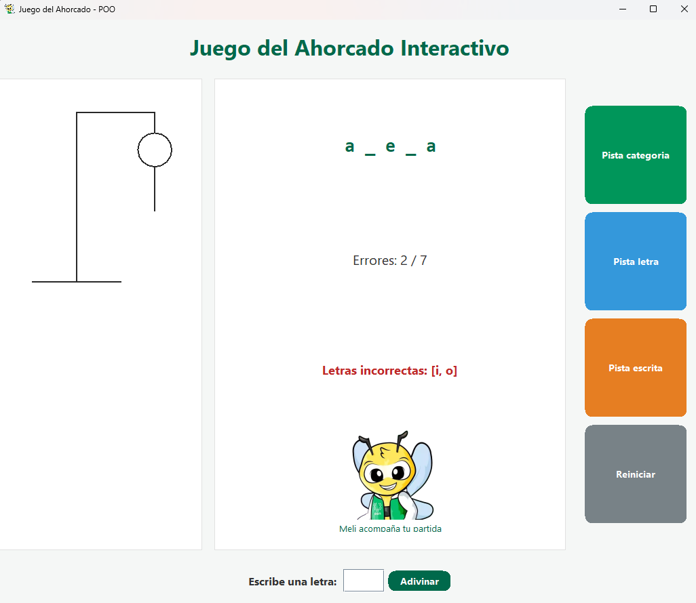
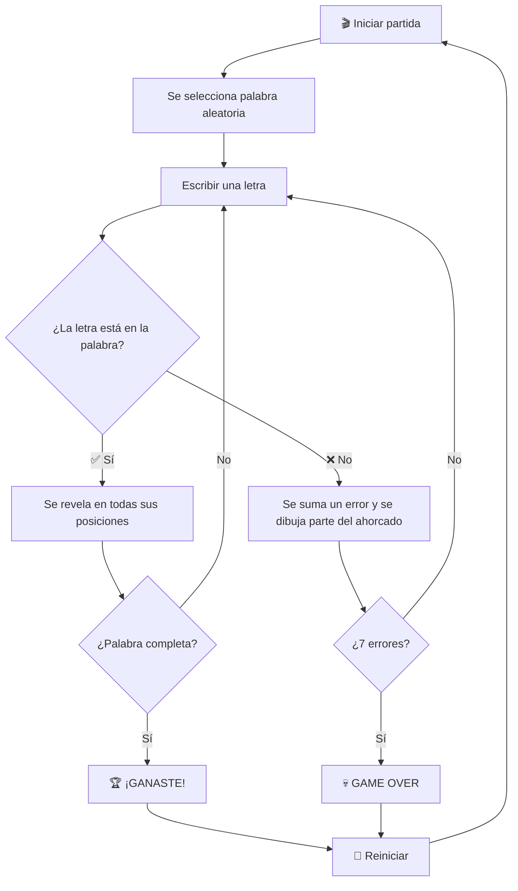
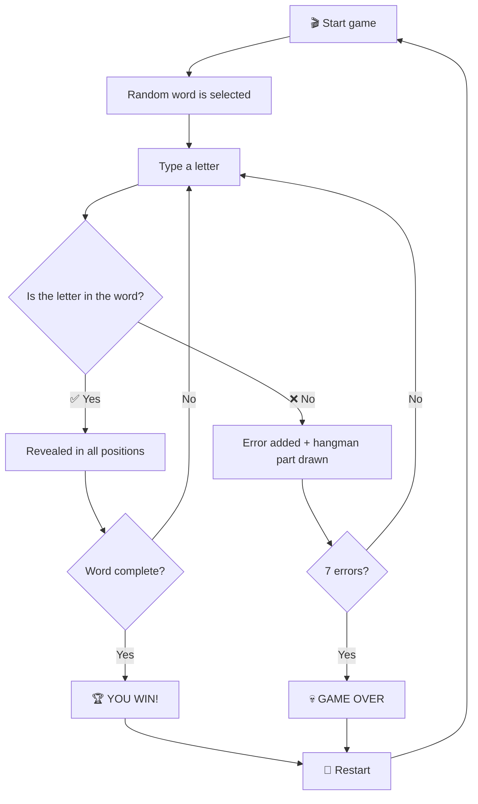

<p align="center">
  
</p>

<h1 align="center">🎮 Juego del Ahorcado Interactivo</h1>

<p align="center">
  
  
  
  
</p>

<p align="center">
  <a href="#-descripción">Español</a> •
  <a href="#-description">English</a>
</p>

---

## 📋 Tabla de Contenidos / Table of Contents

<details>
<summary>🇪🇸 Español</summary>

- [Descripción](#-descripción)
- [Características](#-características)
- [Capturas de Pantalla](#-capturas-de-pantalla)
- [Arquitectura del Proyecto](#-arquitectura-del-proyecto)
- [Requisitos](#-requisitos)
- [Instalación y Ejecución](#-instalación-y-ejecución)
- [Cómo Jugar](#-cómo-jugar)
- [Sistema de Pistas](#-sistema-de-pistas)
- [Categorías de Palabras](#-categorías-de-palabras)
- [Conceptos de POO Aplicados](#-conceptos-de-poo-aplicados)

</details>

<details>
<summary>🇬🇧 English</summary>

- [Description](#-description)
- [Features](#-features)
- [Screenshots](#-screenshots)
- [Project Architecture](#-project-architecture)
- [Requirements](#-requirements)
- [Installation and Running](#-installation-and-running)
- [How to Play](#-how-to-play)
- [Hint System](#-hint-system)
- [Word Categories](#-word-categories)
- [OOP Concepts Applied](#-oop-concepts-applied)

</details>

---

# 🇪🇸 Español

## 📝 Descripción

**Juego del Ahorcado Interactivo** es una aplicación de escritorio desarrollada en Java con interfaz gráfica Swing. El juego implementa la mecánica clásica del ahorcado con un sistema de pistas inteligente, una mascota animada llamada **Meli**, y un banco de más de **200 palabras** organizadas en múltiples categorías.

Este proyecto fue desarrollado como ejercicio académico para la **Universidad EAN**, aplicando principios de Programación Orientada a Objetos (POO) como herencia, polimorfismo y encapsulamiento.

## ✨ Características

| Característica | Descripción |
|---|---|
| 🎨 **Interfaz moderna** | GUI con diseño limpio, botones redondeados y paleta de colores verde institucional |
| 🐾 **Mascota animada** | Meli acompaña la partida con una animación de movimiento |
| 💡 **3 tipos de pistas** | Categoría, letra revelada y pista escrita |
| 📚 **+200 palabras** | Banco extenso con 6 categorías diferentes |
| 🎯 **7 intentos** | Dibujo progresivo del ahorcado con cada error |
| ✅ **Validaciones** | Control de letras repetidas, caracteres inválidos y campo vacío |
| 🔄 **Reinicio rápido** | Nueva partida con un solo clic |

## 📸 Capturas de Pantalla

<p align="center">
  
</p>

## 🏗 Arquitectura del Proyecto

```
src/
├── 📁 modelo/                    # Capa de lógica del juego
│   ├── BancoPalabras.java        # Base de datos de palabras (+200)
│   ├── JuegoAhorcado.java        # Motor principal del juego
│   └── Palabra.java              # Entidad: texto + categoría + pista
│
├── 📁 pistas/                    # Sistema de pistas (herencia)
│   ├── Pista.java                # Clase abstracta base
│   ├── PistaCategoria.java       # Revela la categoría
│   ├── PistaLetra.java           # Revela una letra aleatoria
│   └── PistaEscrita.java         # Muestra una descripción
│
├── 📁 vista/                     # Capa de presentación (Swing)
│   ├── VentanaJuego.java         # Ventana principal con eventos
│   └── PanelAhorcado.java        # Dibujo progresivo con Graphics2D
│
├── 📁 principal/                 # Punto de entrada
│   └── Main.java                 # Lanza la aplicación
│
└── 📁 recursos/                  # Assets
    └── meli.png                  # Imagen de la mascota
```

## 📌 Requisitos

- **Java JDK** 8 o superior
- **IDE recomendado:** Apache NetBeans (proyecto configurado con Ant)
- Sistema operativo: Windows, macOS o Linux

## 🚀 Instalación y Ejecución

### Opción 1: Desde NetBeans
```bash
1. Clonar el repositorio
   git clone https://github.com/tu-usuario/juego-ahorcado.git

2. Abrir el proyecto en NetBeans (File > Open Project)

3. Ejecutar con F6 o clic en Run
```

### Opción 2: Desde terminal
```bash
# Clonar el repositorio
git clone https://github.com/tu-usuario/juego-ahorcado.git
cd juego-ahorcado

# Compilar
javac -d build src/modelo/*.java src/pistas/*.java src/vista/*.java src/principal/*.java

# Ejecutar
java -cp build principal.Main
```

### Opción 3: Usando Ant
```bash
# Compilar y ejecutar con Ant
ant run
```

## 🎮 Cómo Jugar



1. **Escribe una letra** en el campo de texto
2. **Presiona "Adivinar"** para verificar
3. Si aciertas, la letra aparece en la palabra
4. Si fallas, se dibuja una parte del ahorcado
5. Usa las **pistas** si necesitas ayuda
6. ¡Completa la palabra antes de los 7 errores!

## 💡 Sistema de Pistas

| Pista | Icono | Descripción | Ejemplo |
|---|---|---|---|
| **Categoría** | 🏷️ | Muestra a qué grupo pertenece la palabra | "Categoría: animales" |
| **Letra** | 🔤 | Revela una letra oculta aleatoriamente | "Se reveló la letra: a" |
| **Escrita** | 📝 | Da una descripción o pista textual | "Pista: Rey de la selva" |

> ⚠️ Cada pista solo puede usarse **una vez por partida**.

## 📚 Categorías de Palabras

| Categoría | Cantidad | Ejemplos |
|---|---|---|
| 🐾 Animales | 42 | gato, elefante, mariposa, delfín |
| 🎬 Películas | 40 | Encanto, Shrek, Avengers, Coco |
| 🍲 Platos típicos | 40 | Bandeja paisa, ajiaco, sushi, pizza |
| 🏙️ Ciudades | 40 | Bogotá, París, Tokio, New York |
| 🌍 Países | 38 | Colombia, Japón, Francia, Egipto |

**Total: +200 palabras** con pistas únicas para cada una.

## 🧠 Conceptos de POO Aplicados

| Concepto | Implementación |
|---|---|
| **Herencia** | `Pista` (abstracta) → `PistaCategoria`, `PistaLetra`, `PistaEscrita` |
| **Polimorfismo** | Método `mostrarPista()` se comporta diferente en cada subclase |
| **Encapsulamiento** | Atributos privados con getters/setters en todas las clases |
| **Abstracción** | Clase `Pista` define el contrato sin implementación |
| **Composición** | `JuegoAhorcado` contiene `BancoPalabras`, `Palabra` y las pistas |
| **MVC (parcial)** | Separación en paquetes: modelo, vista, principal |

---

# 🇬🇧 English

## 📝 Description

**Interactive Hangman Game** is a desktop application developed in Java with a Swing graphical interface. The game implements the classic hangman mechanics with a smart hint system, an animated mascot called **Meli**, and a word bank of over **200 words** organized in multiple categories.

This project was developed as an academic exercise for **Universidad EAN**, applying Object-Oriented Programming (OOP) principles such as inheritance, polymorphism, and encapsulation.

## ✨ Features

| Feature | Description |
|---|---|
| 🎨 **Modern interface** | Clean GUI design with rounded buttons and institutional green palette |
| 🐾 **Animated mascot** | Meli accompanies the game with a bouncing animation |
| 💡 **3 hint types** | Category, revealed letter, and written hint |
| 📚 **200+ words** | Extensive word bank with 6 different categories |
| 🎯 **7 attempts** | Progressive hangman drawing with each mistake |
| ✅ **Validations** | Control for repeated letters, invalid characters, and empty input |
| 🔄 **Quick restart** | New game with a single click |

## 📸 Screenshots

<p align="center">
  
</p>

## 🏗 Project Architecture

```
src/
├── 📁 modelo/                    # Game logic layer
│   ├── BancoPalabras.java        # Word database (200+)
│   ├── JuegoAhorcado.java        # Main game engine
│   └── Palabra.java              # Entity: text + category + hint
│
├── 📁 pistas/                    # Hint system (inheritance)
│   ├── Pista.java                # Abstract base class
│   ├── PistaCategoria.java       # Reveals the category
│   ├── PistaLetra.java           # Reveals a random letter
│   └── PistaEscrita.java         # Shows a text description
│
├── 📁 vista/                     # Presentation layer (Swing)
│   ├── VentanaJuego.java         # Main window with events
│   └── PanelAhorcado.java        # Progressive drawing with Graphics2D
│
├── 📁 principal/                 # Entry point
│   └── Main.java                 # Launches the application
│
└── 📁 recursos/                  # Assets
    └── meli.png                  # Mascot image
```

## 📌 Requirements

- **Java JDK** 8 or higher
- **Recommended IDE:** Apache NetBeans (project configured with Ant)
- Operating System: Windows, macOS, or Linux

## 🚀 Installation and Running

### Option 1: From NetBeans
```bash
1. Clone the repository
   git clone https://github.com/your-username/juego-ahorcado.git

2. Open the project in NetBeans (File > Open Project)

3. Run with F6 or click Run
```

### Option 2: From terminal
```bash
# Clone the repository
git clone https://github.com/your-username/juego-ahorcado.git
cd juego-ahorcado

# Compile
javac -d build src/modelo/*.java src/pistas/*.java src/vista/*.java src/principal/*.java

# Run
java -cp build principal.Main
```

### Option 3: Using Ant
```bash
# Compile and run with Ant
ant run
```

## 🎮 How to Play



1. **Type a letter** in the text field
2. **Press "Adivinar" (Guess)** to check
3. If correct, the letter appears in the word
4. If wrong, a part of the hangman is drawn
5. Use **hints** if you need help
6. Complete the word before 7 mistakes!

## 💡 Hint System

| Hint | Icon | Description | Example |
|---|---|---|---|
| **Category** | 🏷️ | Shows which group the word belongs to | "Categoría: animales" |
| **Letter** | 🔤 | Reveals a random hidden letter | "Se reveló la letra: a" |
| **Written** | 📝 | Gives a textual description or clue | "Pista: Rey de la selva" |

> ⚠️ Each hint can only be used **once per game**.

## 📚 Word Categories

| Category | Count | Examples |
|---|---|---|
| 🐾 Animals | 42 | cat, elephant, butterfly, dolphin |
| 🎬 Movies | 40 | Encanto, Shrek, Avengers, Coco |
| 🍲 Traditional dishes | 40 | Bandeja paisa, ajiaco, sushi, pizza |
| 🏙️ Cities | 40 | Bogotá, Paris, Tokyo, New York |
| 🌍 Countries | 38 | Colombia, Japan, France, Egypt |

**Total: 200+ words** with unique hints for each one.

## 🧠 OOP Concepts Applied

| Concept | Implementation |
|---|---|
| **Inheritance** | `Pista` (abstract) → `PistaCategoria`, `PistaLetra`, `PistaEscrita` |
| **Polymorphism** | `mostrarPista()` method behaves differently in each subclass |
| **Encapsulation** | Private attributes with getters/setters in all classes |
| **Abstraction** | `Pista` class defines the contract without implementation |
| **Composition** | `JuegoAhorcado` contains `BancoPalabras`, `Palabra`, and hints |
| **MVC (partial)** | Package separation: modelo, vista, principal |

---

---

## 👩‍💻 Autoras / Authors

<table align="center">
  <tr>
    <td align="center"><b>Daniela Sophia Coavas Barboza</b></td>
    <td align="center"><b>Natalia Lozano Sánchez</b></td>
    <td align="center"><b>Mariana Andrea Rodríguez Bernal</b></td>
  </tr>
</table>

<p align="center">
  
</p>

<p align="center">
  <b>Proyecto Final - Programación Orientada a Objetos</b><br>
  <i>Final Project - Object-Oriented Programming</i>
</p>

<p align="center">
  <b>Desarrollado con ❤️ para la Universidad EAN</b><br>
  <i>Developed with ❤️ for Universidad EAN</i>
</p>

<p align="center">
  
  
</p>
